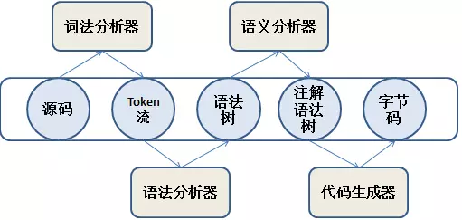

# 如何运行

- 执行`mvn clean install -DskipTests=true`编译`demo-ast`项目；
- 会安装`demo-asj-papa`模块自定义注解处理器jar到本地库；
  - 在该模块下执行`javap target/classes/xj/love/hj/demo/ast/test/pojo/Sample.class`，查看对`@Getter`注解处理结果；
  - 在该模块下执行`javap target/classes/xj/love/hj/demo/ast/test/pojo/SampleBuilder.class`，查看对`@Builder`注解处理结果；
- 会安装`demo-jvmti-agent`模块自定义java agent jar到本地库；
  - 启动`Application`类（增加jvm参数: -javaagent:${workspace}\hello-world\demos\demo-ast\demo-jvmti-agent\target\demo-jvmti-agent-1.0.0-SNAPSHOT.jar），
  浏览器访问 http://localhost:8080/samples?name=sunny 在控制台查看启动时动态加载agent处理。
  - 启动`AgentLoader`类（增加cmd参数: demo.ast.test.Application ${workspace}\hello-world\demos\demo-ast\demo-jvmti-agent\target\demo-jvmti-agent-1.0.0-SNAPSHOT.jar），
  再次在浏览器访问 http://localhost:8080/samples?name=sunny 在控制台查看启动后动态加载agent处理。

## 禁用IDEA错误提示

打开`Sample.java`，选择`Analyze -> Configure Current File Anaylisis...`，将其设置为none即可。

# javac编译步骤

# 插件化注解处理API使用步骤

1. 自定义一个注解，注解的元注解需要指定`@Retention(RetentionPolicy.SOURCE)`。
2. 自定义一个注解处理器，需要继承[javax.annotation.processing.AbstractProcessor](https://docs.oracle.com/javase/8/docs/api/javax/annotation/processing/AbstractProcessor.html)，并重写process方法。
3. 需要在声明的自定义注解处理器中使用[javax.annotation.processing.SupportedAnnotationTypes](https://docs.oracle.com/javase/8/docs/api/javax/annotation/processing/SupportedAnnotationTypes.html)指定步骤1所创建的注解类型的名称
(注意需要全类名，"包名.注解类型名称"，否则会不生效)。
4. 需要在声明的自定义注解处理器中使用[javax.annotation.processing.SupportedSourceVersion](https://docs.oracle.com/javase/8/docs/api/javax/annotation/processing/SupportedSourceVersion.html)指定编译版本。
5. 可选操作，可以通在声明的自定义注解处理器中使用[javax.annotation.processing.SupportedOptions](https://docs.oracle.com/javase/8/docs/api/javax/annotation/processing/SupportedOptions.html)指定编译参数。

# java agent原理

> 参考链接：[JSR 269: Pluggable Annotation Processing API](https://jcp.org/en/jsr/detail?id=269)
& [Lombok reduces your boilerplate code](https://blog.frankel.ch/lombok-reduces-your-boilerplate-code/)
& [JVM Tool API](https://docs.oracle.com/javase/7/docs/platform/jvmti/jvmti.html)
& [java.lang.instrument](https://docs.oracle.com/javase/8/docs/api/java/lang/instrument/package-summary.html)
& [byte buddy](https://github.com/raphw/byte-buddy)
